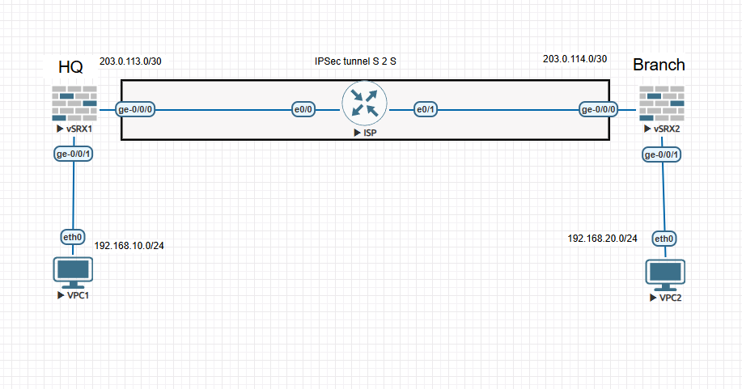

# Juniper SRX Route-Based IPsec Site-to-Site VPN (EVE-NG)

An EVE-NG lab connecting two LANs through an ISP router using an IKEv2, route-based IPsec VPN between Juniper SRX firewalls.

> Security note: No real pre-shared key, password, public IP address, or device ID belongs in this repository. Replace all <placeholder> values locally before loading a config.

## Topology

The ISP router provides underlay reachability between the two SRX untrust interfaces; it does not terminate the VPN. The route-based IKEv2/IPsec tunnel is bound to `st0.0` on each SRX.

## Addressing

| Component | Address / network |
| --- | --- |
| VPC1 / SRX-1 gateway | 192.168.10.10/24 / 192.168.10.1 |
| LAN-A | 192.168.10.0/24 |
| VPC2 / SRX-2 gateway | 192.168.20.10/24 / 192.168.20.1 |
| LAN-B | 192.168.20.0/24 |
| SRX-1 WAN / ISP e0/0 | 203.0.113.1/30 / 203.0.113.2/30 |
| ISP e0/1 / SRX-2 WAN | 203.0.114.1/30 / 203.0.114.2/30 |
| PSK | Replace <REPLACE_WITH_STRONG_PSK> locally on both SRXs |

## Contents

    configs/srx-1/             SRX-1 configuration, divided by area
    configs/srx-2/             SRX-2 configuration, divided by area
    configs/srx-1/06-policy-order-fix.set  SRX-1 final working correction
    configs/srx-2/06-policy-order-fix.set  SRX-2 final working correction
    configs/ISP-router.cfg     Cisco IOSv/IOS-L3 ISP configuration
    configs/ISP-router-notes.md  Underlay routing notes
    docs/troubleshooting.md    Packet-path checks and the policy-order lesson

## Deploy

1. Build two SRXs, one routed ISP node, and two VPCs in EVE-NG.
2. Connect VPC1 to SRX-1 ge-0/0/1; connect both SRX ge-0/0/0 interfaces to the ISP; connect VPC2 to SRX-2 ge-0/0/1. Update the config if your interface names differ.
3. Set VPC1 to 192.168.10.10/24 with gateway 192.168.10.1. Set VPC2 to 192.168.20.10/24 with gateway 192.168.20.1.
4. For each SRX, load the numbered files in order: interfaces/zones, routing, IKE, IPsec, then the original policy-order file. Replace only the PSK placeholder.
5. Configure the ISP with configs/ISP-router.cfg.
6. Load the final 06-policy-order-fix.set file on each SRX. This preserves the lab's troubleshooting story while leaving the device in its final working state.
7. Test a ping from VPC1 to 192.168.20.10 and the reverse from VPC2.

## Validation

    show security ike security-associations
    show security ipsec security-associations
    show security ipsec statistics
    show route 192.168.20.0/24
    show security flow session
    show security policies hit-count

Expected: IKE and IPsec SAs are established, the remote LAN route uses st0.0, IPsec counters increase, and the specific permit policies receive hits.

## Critical lesson: policy order

Junos evaluates security policies from top to bottom. A broad default-deny before a specific VPN permit captures and denies the packet before the permit is evaluated.

    Incorrect: default-deny -> LAN-A-TO-LAN-B
    Correct:   LAN-A-TO-LAN-B -> default-deny

The policy files contain only the policies added for this lab; the pre-existing default-deny is intentionally omitted. Apply each SRX's 06-policy-order-fix.set to move the specific permit above that existing default-deny. See docs/troubleshooting.md for the confirmed troubleshooting outcome.

## Push to GitHub

Create a new empty GitHub repository, then run this from this folder:

    git init
    git add .
    git status
    git commit -m "Add Juniper SRX IPsec EVE-NG lab"
    git branch -M main
    git remote add origin https://github.com/<YOUR-USERNAME>/juniper-srx-ipsec-eve-ng-lab.git
    git push -u origin main

Before the first push, inspect git status and search staged files for the real PSK. Keep device backups and EVE-NG exports outside Git.

## License

MIT. See LICENSE.
